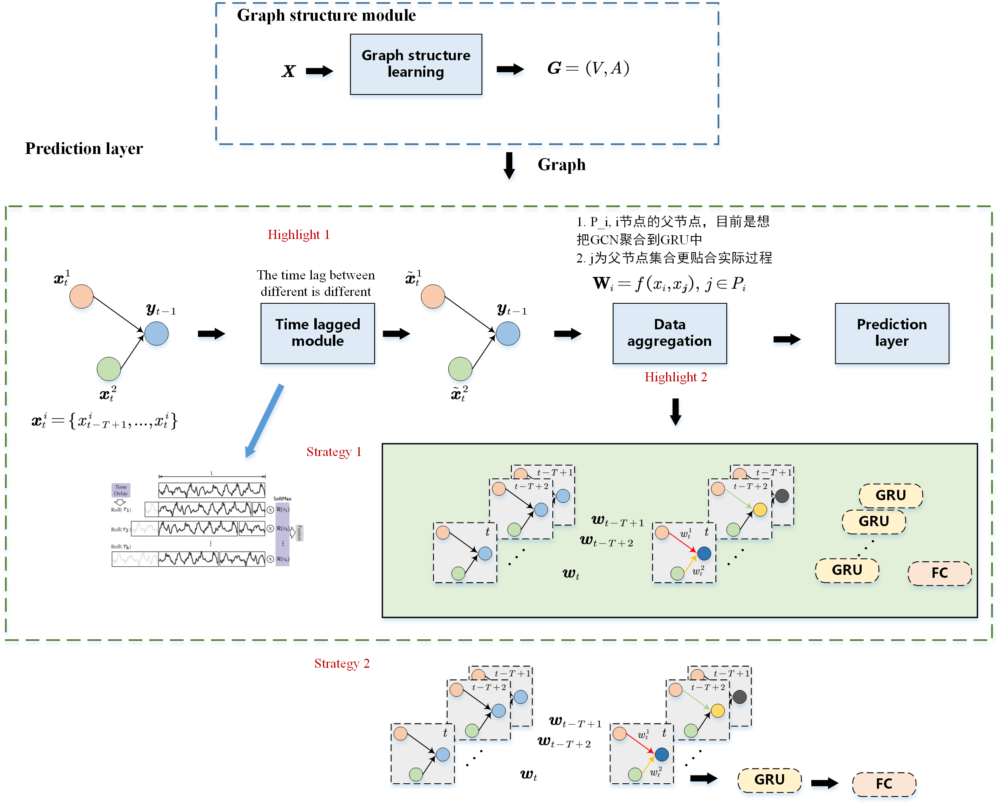

Input data:
$\bf{X}\in \mathbb{R}^{N*T*F}$,$\text N$: node number, $\text T$: sequence length, $\text F$: feature number.
$y\in\mathbb{R}$
Problem state:
$$ y_t = f_{\theta}(\bf{X}_{t-T+1},\bf{X}_{t-T+2},...,\bf{X}_t,y_{t-T},...,y_{t-1})$$
$$\theta^*=\mathop{\text{minimize}}\limits_{\theta}\sum_{i=1}^{i=N_{test}}(y_i-f_{\theta}(\cdot))$$

---
### Time lagged Module
计算每个模型输入序列的父节点相对于子节点的时滞

**Input data**：
- $\bf{X}_t\in \mathbb{R}^{N*T}$, $\text N$: node number, $\text T$:sequence length.
- $\bf{A}$: adjacency matrix, $a_{ij}\neq 0$ means that node $i$ is point to node $j$, $a_{ii}$ is 0.

**Output data**:
- $\bf X_{delay}\in \mathbb{R}^{N*N*T}$, $i$th row $j$th col element item is the shifted sequence according to the time lagged with its children node, recorded in $d_{ji}$.
- $\bf D \in \mathbb{R}^{N*N}$
- $\text K$: max time delay.
$$d_{ji}=max(f_{cr}(\bm{x}_i\leftarrow k,\bm{x}_j),\forall k \in (1,2,...,\text K))$$
$f_{cr}$: 互相关计算公式，**上式未展开**

---
### AttenGGRU(attention based Graph Gated recurrent units)

**不考虑时滞**时的formula:
**Input data**:
- $\bf{X}_t\in \mathbb{R}^{N*T}$
- $\bf{X}_{delay}$
- $\bf{A}$

**Output data**:
- $y_t$

$y_t=f_{aggru}(\bf{X}_t, \bf{X}_{delay}, \bf{A})$, $f_{aggru}$包括两部分：dynamic local adjacency matrix calculation & data aggregation.


$$\bf{H}_{i,t}=aggregate(\bf{H}_{i,t-1}, \bf{H}_{j,t-1}), \forall j \in \mathcal{N}_i$$

For a single node:
Aggregator这边用的自注意力加权：$q$: Node $i$, $k and\; v$: node $j$, $\forall j \in \mathcal{N}_i$
$q_i=\bm{x}^iW_Q, \; k_i=\bm{x}^iW_K,\; v_i=\bm{x}^iW_V$
$$e_{ij}=softmax(\frac{q_ik^T_i}{\sqrt{d_k}})v_i$$
For matrix form(for computation efficiency):
$\bf{Q}_t = X_tW_Q, K_t=X_tW_K,V_t=X_tW_V$
$$E=mask(softmax(\frac{QK^T}{\sqrt{d_k}}V))$$
$$\bf H_{i,t}=\theta_1 H_{i,t-1}+\theta_2\sum_{j=1}^{j\in\mathcal{N_i}}e_{ij}H_{j,t-1}$$
used attention based graph convolution as matrix operation of GRU, can get the formulation:
traditional GRU:
Denotation: $j$:jth unit.
$$h_t^j=(1-z_t^j)h_{t-1}^j+z_t^j\tilde{h}_t^j, \;\;(liear\; interpolation)$$
$$z_t^j=\sigma(W_z\bm{x}_t+U_z\bm(h_{t-1}))\;\; (update\; gate)$$
$$\tilde{h}_t^j=\text{tanh}(W\bm{x}_t+U(\bm{r}_t\odot\bm{h}_t))^j\;\;(candidate\; activation)$$
$$r_t^j=\sigma(W_r\bm(x)_t+U_r\bm{h}_{t-1})^j,\;\;(reset\; gate)$$
For AGGRU: replaced matrix $W_z, W, W_R$ with attention based graph convolution.

---
<!--  -->

---
Pesudo code
input data $X\in \mathbb{R}^{N*T*F}$, target left shift in $X$, prior adjaceny matrix $A_p$

**Overall Framework**
```
# one predict
dynamic graph A_d = dynamic_graph_learning(X) # module 1
time delay matrix X_delay = time_delay_calculation(X) # module 2
for i in range(T):
    hidden = AttenGRUCell(X[t], X_delay[t], A_p, A_d) # module 3
prediction = pred_layer(hidden) # module 4
```
**dynamic graph learning module**
```
# 优先考虑动态因果图
```
**time delay caculation**
```
# 使用快速傅里叶计算
```
**AttenGRUCell**(后续需要对这个模型的名称进行变化)
```
# X_d[t], shape: (N*N), 需要检查边的指向关系
delay_agg = sumByRow(X_d[t]W), X_d中已经包含了邻接矩阵的关系了。W shape: (N*N): learnable parameter
# 下面的卷积有选择的选作GRN的 Matrix multiply operation 的替代。
h1 = GCN(X_t, A_d)
h2 = graph attention conv(X_t||delay_agg)
h = alpha*h1 + beta*h2 (weighted sum)

```

### Data overflow
